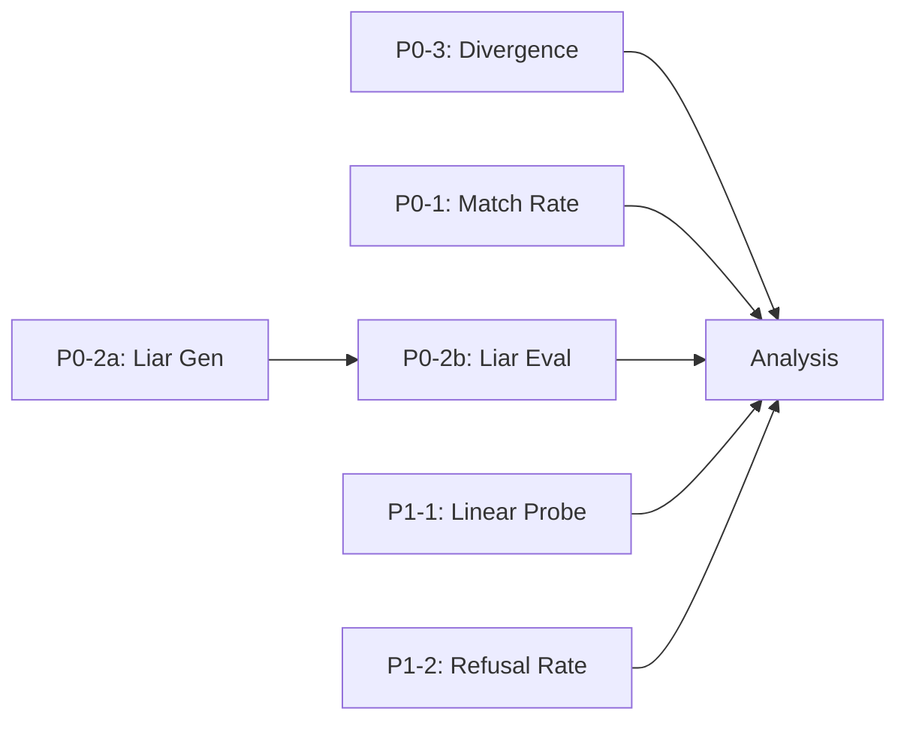

# Experiment Sbatch Files

Sbatch files for running ORCA paper experiments on SLURM cluster.

## 🚀 Quick Start

```bash
cd examples/train/experiment_sbatch

# Submit all experiments
./submit_all.sh all

# Or submit by priority
./submit_all.sh p0   # Critical only
./submit_all.sh p1   # Validation only
./submit_all.sh p2   # Ablation training only
```

---

## 📋 Recommended Execution Order

### Phase 1: Quick Wins (Day 1-2)
```bash
# 1️⃣ P0-3: Divergence Rate (最快完成，1天)
sbatch P0_3_divergence.sbatch

# 2️⃣ P0-2a: 同時生成 Liar Data (不需 GPU，4小時)
sbatch P0_2_liar_gen.sbatch
```

### Phase 2: Main Experiments (Day 2-5)
```bash
# 3️⃣ P0-1: Match Rate (需要 P0-3 完成後分析，12小時)
sbatch P0_1_match_rate.sbatch

# 4️⃣ P0-2b: Liar Eval (需要 P0-2a 生成的資料，8小時)
sbatch P0_2_liar_eval.sbatch

# 5️⃣ P1-1: Linear Probing (可平行，6小時)
sbatch P1_1_linear_probe.sbatch

# 6️⃣ P1-2: Refusal Rate (可平行，4小時)
sbatch P1_2_refusal.sbatch
```

### Phase 3: Ablation Training (Week 2+, if time permits)
```bash
# 這些是訓練 job，需要 48 小時
cd ../ablation_sbatch

# 7️⃣ 8️⃣ 9️⃣ P2-1: Component Ablation (可平行)
sbatch P2_ortho_only.sbatch
sbatch P2_dropout_only.sbatch
sbatch P2_dpo_only.sbatch
```

---

## 📊 Experiment Files

### P0: Critical (必須在提交前完成)

| # | File | Experiment | GPU | Time | 依賴 |
|---|------|------------|-----|------|------|
| 1 | `P0_3_divergence.sbatch` | Divergence Rate | 1 | 24h | - |
| 2 | `P0_2_liar_gen.sbatch` | Generate Liar Data | 0 | 4h | - |
| 3 | `P0_1_match_rate.sbatch` | Match Rate | 1 | 12h | - |
| 4 | `P0_2_liar_eval.sbatch` | Liar Eval | 1 | 8h | P0-2a |

### P1: Validation (應該完成)

| # | File | Experiment | GPU | Time | 依賴 |
|---|------|------------|-----|------|------|
| 5 | `P1_1_linear_probe.sbatch` | Linear Probing | 1 | 6h | - |
| 6 | `P1_2_refusal.sbatch` | Refusal Rate | 1 | 4h | - |

### P2: Ablation Training (如果有時間)

| # | File | Configuration | GPU | Time |
|---|------|---------------|-----|------|
| 7 | `P2_ortho_only.sbatch` | Orthogonal Encoder only | 2 | 48h |
| 8 | `P2_dropout_only.sbatch` | ASR Dropout only | 2 | 48h |
| 9 | `P2_dpo_only.sbatch` | Modality-DPO only | 2 | 48h |

---

## ⚙️ Configuration

**修改模型路徑** (每個 sbatch 檔案):
```bash
MODEL_DESTA="voidful/desta25-qwen3-4b"      # DeSTA baseline
MODEL_ORCA="voidful/desta25-4b-R2-full"    # ← 修改為你的 ORCA 模型
```

---

## 📁 Output

Results saved to:
```
/work/voidful2nlp/desta/experiment_results/
├── P0_3_divergence/    # divergence_summary.json
├── P0_1_match_rate/    # desta/, orca/
├── P0_2_liar/          # data/, eval/
├── P1_1_linear_probe/  # desta/, orca/
└── P1_2_refusal/       # desta/, orca/
```

---

## 🔗 Dependencies



The `submit_all.sh` script handles the P0-2 dependency automatically.
